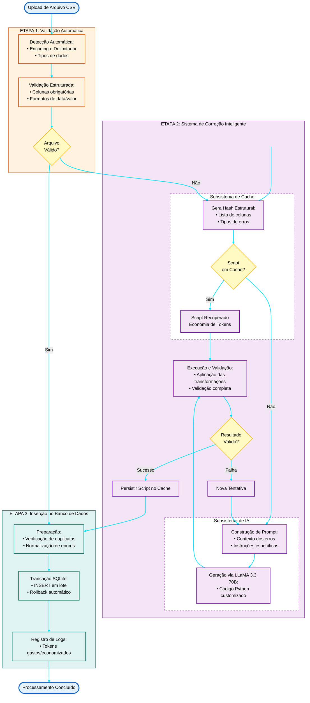

Markdown

# Desafio Técnico: Pipeline de Ingestão CSV com IA

Solução desenvolvida para o desafio de automação e ingestão de dados financeiros utilizando Python e Streamlit. O sistema utiliza Inteligência Artificial para gerar scripts de correção automática de arquivos CSV com problemas de formatação, implementando um sistema de cache inteligente para evitar chamadas desnecessárias à API.

## Índice

- [Configuração do Ambiente](#configuração-do-ambiente)
- [Como Executar](#como-executar)
- [Arquitetura da Solução](#arquitetura-da-solução)
- [Destaques de Engenharia e Decisões de Arquitetura](#destaques-de-engenharia-e-decisões-de-arquitetura)
- [Filosofia de UX](#filosofia-de-ux)
- [Estrutura do Projeto](#estrutura-do-projeto)
- [Descrição dos Módulos Principais](#descrição-dos-módulos-principais)
- [Services (Camada de Serviços)](#services-camada-de-serviços)
- [Utils (Utilitários)](#utils-utilitários)
- [Fluxo de Processamento](#fluxo-de-processamento)
- [Funcionalidades Principais](#funcionalidades-principais)
- [Tecnologias Utilizadas](#tecnologias-utilizadas)
- [Testes](#testes)
- [Roadmap e Melhorias Futuras](#roadmap-e-melhorias-futuras)
- [Observações Técnicas](#observações-técnicas)

---

## Configuração do Ambiente

Siga os passos abaixo para criar o ambiente virtual isolado e instalar as dependências.

### 1. Criar e Ativar Ambiente Virtual

**Windows:**
```bash
python -m venv venv
.\venv\Scripts\activate
```

**Linux / macOS:**
```bash
python3 -m venv venv
source venv/bin/activate
```

### 2. Instalar Dependências

Com o ambiente virtual ativo, instale as bibliotecas listadas no `requirements.txt`:

```bash
pip install -r requirements.txt
```

### 3. Configurar Credenciais da IA

O sistema utiliza a API do Groq (LLaMA 3.3 70B). Ao executar pela primeira vez, você será direcionado para a página de configurações onde deverá inserir sua API Key.

Alternativamente, você pode criar manualmente o arquivo `app/secrets.env`:

```env
GROQ_API_KEY=sua_chave_aqui
```

> **Nota:** Obtenha sua chave gratuitamente em [console.groq.com](hhttps://console.groq.com/keys)

---

## Como Executar

Para iniciar a aplicação web, execute o comando abaixo na raiz do projeto:

```bash
streamlit run app/main.py
```

A aplicação será aberta automaticamente no navegador em `http://localhost:8501`.

---

## Arquitetura da Solução

O projeto implementa um pipeline completo de ingestão de dados com as seguintes características:

### Pipeline de Processamento



### Componentes Principais

1. **Validação Automática**: Detecta problemas em arquivos CSV (encoding, delimitador, formato de dados)
2. **Correção com IA**: Gera scripts Python personalizados para corrigir problemas específicos
3. **Sistema de Cache**: Armazena scripts validados e os reutiliza para arquivos similares
4. **Banco de Dados**: SQLite para persistência de transações e logs
5. **Dashboard**: Monitoramento de processamentos e economia de tokens

---

## Destaques de Engenharia e Decisões de Arquitetura

### O Problema: Ingestão de CSVs Financeiros é Caótica por Natureza

Ingerir arquivos CSV de transações financeiras em ambientes corporativos reais apresenta desafios complexos que vão além da simples leitura de dados estruturados. A realidade é que:

- **Formatos variam imprevisívelmente**: Delimitadores oscilam entre vírgula e ponto-e-vírgula dependendo da origem
- **Encodings causam corrupção silenciosa**: UTF-8 vs Latin-1 pode transformar "João" em "Jo√£o"
- **Dados chegam sujos**: Datas em DD/MM/YYYY quando o banco espera YYYY-MM-DD, valores monetários com "R$" e pontos de milhar como texto
- **Variações semânticas**: Uma coluna chamada "data_transacao" em um arquivo e "dt_lancamento" em outro referem-se ao mesmo conceito

Validar isso manualmente é inviável em escala. Regras rígidas baseadas em Regex falham com variações imprevistas. O sistema precisava ser **robusto o suficiente para detectar erros automaticamente** e **flexível o bastante para corrigi-los sem intervenção humana**.

---

### A Solução: Arquitetura Híbrida (Validação Rígida + Correção Flexível)

A arquitetura desenvolvida combina o melhor de dois mundos:

**Camada Determinística (Pandas + Validação Estruturada)**
- Detecta encoding e delimitador automaticamente usando heurísticas
- Aplica validações rígidas baseadas em um template JSON (schema do banco)
- Identifica **exatamente** onde estão os erros: colunas faltando, formatos inválidos, valores não permitidos

**Camada Adaptativa (LLM - LLaMA 3.3 70B via Groq)**
- Recebe contexto estruturado dos erros detectados
- Gera código Python personalizado para corrigir problemas específicos
- Valida automaticamente se a correção funciona antes de permitir a inserção

#### Por que essa abordagem?
- **Pandas** é excelente para dizer "*onde* está o erro", mas ruim em inferir "*como* corrigir" em contextos variados
- **LLMs** são excelentes em gerar transformações contextuais, mas não confiáveis para validação rígida
- **Juntos**, criam um sistema que é ao mesmo tempo **preciso** e **adaptável**

---

### Cache Inteligente: Smart Structural Hashing

#### Problema
Enviar o mesmo padrão de erro repetidamente para a IA é:
- **Caro**: Cada chamada consome tokens (custo direto)
- **Lento**: Latência de rede + tempo de inferência do LLM
- **Redundante**: Arquivos gerado periodicamente tendem a seguir a mesma estrutura

#### Solução: Assinatura de Problema Estrutural

Em vez de cachear pelo **conteúdo do arquivo** (hash MD5 simples), criamos um **hash semântico da estrutura do problema**:

```python
# Gera hash estrutural baseado em colunas e tipos de erros
estrutura = {
    "colunas": sorted(colunas),
    "erros_detalhados": sorted(assinaturas_erros, key=lambda x: json.dumps(x, sort_keys=True))
}

estrutura_json = json.dumps(estrutura, sort_keys=True, ensure_ascii=False)
hash_estrutural = hashlib.md5(estrutura_json.encode('utf-8')).hexdigest()
```

**Exemplo Prático:**
- `janeiro_2025.csv` tem:
  - Colunas: `[id, data, valor, tipo, status]`
  - Erros: `[formato_data_br, formato_valor_br, coluna_faltando: 'categoria']`
  
- `fevereiro_2025.csv` tem:
  - Colunas: `[id, data, valor, tipo, status]`
  - Erros: `[formato_data_br, formato_valor_br, coluna_faltando: 'categoria']`

**Resultado:** Ambos geram o **mesmo hash estrutural** → O script de correção de janeiro é **reutilizado instantaneamente** para fevereiro, com **custo zero de tokens**.

#### Impacto Mensurável
- **Economia** em custos de API.
- **Redução** no tempo de processamento para arquivos recorrentes
- **Escalabilidade**: Sistema aprende com o uso, tornando-se mais eficiente ao longo do tempo

---

### Engenharia de Prompt Dinâmica: Context-Aware Instructions

#### Problema: LLMs Alucinam
Se enviarmos um prompt genérico como *"Corrija este CSV"*, o modelo pode:
- Inventar dados inexistentes
- Remover colunas importantes
- Criar transformações que violam constraints do banco (ex: valores negativos em campos que exigem `> 0`)

#### Solução: Instruções Imperativas Específicas por Tipo de Erro

O sistema **injeta dinamicamente instruções técnicas precisas** baseadas em cada erro detectado:

**Exemplo 1: Coluna Faltando**
```
Erro Detectado: Coluna 'categoria' está ausente

Instrução Injetada no Prompt:
"CRÍTICO - A coluna 'categoria' é OBRIGATÓRIA conforme template.json.
Crie-a explicitamente no DataFrame.
Preencha com o valor padrão 'OUTROS' conforme regra de negócio.
NÃO use pd.NA ou np.nan - use None para compatibilidade com SQLite."
```

**Exemplo 2: Formato de Data Brasileiro**
```
Erro Detectado: Coluna 'data_transacao' está em formato DD/MM/YYYY

Instrução Injetada:
"A coluna 'data_transacao' deve estar no formato ISO 8601 (YYYY-MM-DD).
Identifique o formato atual (use pd.to_datetime com inferência).
Converta para 'YYYY-MM-DD' usando strftime.
Mantenha timezone-naive para compatibilidade com SQLite."
```

#### Por que isso funciona?
1. **Reduz espaço de solução**: O modelo não precisa "adivinhar" o que fazer
2. **Garante conformidade**: Instruções incluem constraints do banco de dados
3. **Evita alucinações**: Contexto técnico específico diminui criatividade indesejada
4. **Permite retry inteligente**: Se falhar, sabemos exatamente qual instrução não foi seguida

#### Validação em Múltiplas Camadas
1. **Sintaxe**: Código Python gerado segue padrões estabelecidos
2. **Execução**: Código aplicado ao DataFrame com tratamento de exceções
3. **Semântica**: DataFrame resultante passa novamente por `validar_csv_completo()`
4. **Retry Inteligente**: Usuário pode tentar novamente quantas vezes necessário, com feedback do erro anterior injetado no próximo prompt

---

### Execução Segura de Código Gerado

Executar código gerado por IA requer validações rigorosas. O sistema implementa:

```python
# O código gerado pela IA modifica o DataFrame diretamente
# Exemplo de código gerado:
df['valor'] = df['valor'].str.replace('R$', '').str.replace('.', '').str.replace(',', '.').astype(float)
df['data_transacao'] = pd.to_datetime(df['data_transacao'], format='mixed', dayfirst=True).dt.strftime('%Y-%m-%d')
df = df.loc[:, ~df.columns.duplicated()]

# Após execução, validação automática
resultado = validar_csv_completo(df_corrigido, template)

# Se falhar, registra erro e permite nova tentativa com feedback
if not resultado["valido"]:
    st.session_state["erro_anterior"] = resultado["detalhes"]
    st.session_state["script_anterior"] = codigo_ia
```

---

### Persistência Inteligente: Logs + Métricas

Todo processamento gera logs estruturados em SQLite:

- **Rastreabilidade**: Hash do arquivo, timestamp, status, etapa de falha
- **Custo**: Tokens gastos vs economizados (cache)
- **Performance**: Duração, tentativas de IA, taxa de sucesso
- **Auditoria**: Registros inseridos, duplicados, erros

Esses dados alimentam o **Dashboard** com métricas acionáveis para gestão.

---

## Filosofia de UX

### Princípio 1: Fail-Safe by Design (À Prova de Falhas)

O sistema foi arquitetado para não ser possível de usar incorretamente:

#### Pipeline Bloqueante
O usuário não consegue avançar para a etapa de "Inserção no Banco" se a etapa de "Correção" não estiver 100% validada. Isso previne:
- Inserção de dados corrompidos
- Violação de constraints do banco
- Necessidade de rollback manual

**Implementação Técnica:**
```python
class FileSession:
    def __init__(self, uploaded_file, file_id):
        self.status = "PROCESSANDO"  # Status inicial
        self.df_original = None
        self.df_corrigido = None
        self.validacao = None
        # ...
    
    # Status possíveis:
    # "PROCESSANDO" -> "PRONTO_VALIDO" (se válido)
    # "PROCESSANDO" -> "PENDENTE_CORRECAO" (se inválido)
    # "PENDENTE_CORRECAO" -> "PRONTO_IA" / "PRONTO_CACHE" (após correção)
    # Qualquer PRONTO_* -> "CONCLUIDO" (após inserção)
```

Apenas arquivos com status `PRONTO_VALIDO`, `PRONTO_IA` ou `PRONTO_CACHE` aparecem na fila de inserção.

#### Feedback Instantâneo
A cada etapa, o usuário vê:
- **O que funcionou** (colunas corretas, formatos válidos)
- **O que precisa atenção** (erros detectados com linguagem clara)
- **Quanto tempo levou** (percepção de performance)

---

### Princípio 2: Transparência Operacional

Mostrar **como o sistema funciona** aumenta a confiança do usuário.

#### Tangibilização de Valor
O Dashboard exibe:
- **Tokens Gastos**: Custo real com chamadas de IA
- **Tokens Economizados**: Valor evitado pelo cache
- **Taxa de Reuso**: % de arquivos que usaram cache

**Por quê?** Em ambientes corporativos, justificar ROI de soluções de IA é crítico. Ao mostrar economia mensurável, transformamos o sistema de "custo operacional" para "investimento que se paga".

#### Visibilidade do Código Gerado
Antes de executar o script de correção, o usuário:
1. Vê o código Python completo gerado pela IA
2. Pode revisar as transformações propostas
3. Decide executar ou cancelar

Isso combina **automação com controle**, essencial em domínios financeiros regulados.

---

### Princípio 3: Separação de Preocupações (Abstração Progressiva)

#### Linguagem de Negócio vs Linguagem Técnica

**O que o usuário vê:**
- "Formato de Data Inválido"
- "Coluna 'Categoria' Ausente"
- "Valores Monetários com Formatação Incorreta"

**O que o sistema faz nos bastidores:**
```python
# Detecção de formato de data
for formato in ['%d/%m/%Y', '%Y-%m-%d', '%d-%m-%Y']:
    try:
        pd.to_datetime(df['data'], format=formato)
    except:
        continue

# Transformação de valores monetários
df['valor'] = (
    df['valor']
    .str.replace('R$', '')
    .str.replace('.', '')
    .str.replace(',', '.')
    .astype(float)
)
```

O usuário não precisa saber Pandas ou Regex - ele só precisa entender o problema de negócio.

---

### Princípio 4: Graceful Degradation (Degradação Elegante)

Quando algo falha, o sistema **nunca deixa o usuário sem opções**:

#### Cenário: Correção Falha na Validação
1. Sistema gera código de correção via IA
2. Executa e valida o resultado
3. Se falhar, usuário pode tentar novamente quantas vezes necessário
4. Cada nova tentativa recebe feedback detalhado do erro anterior
5. Usuário também pode optar por descartar o arquivo

#### Cenário: Inserção Parcial
Se 100 registros são enviados e 20 falham:
- 80 são inseridos com sucesso
- 20 são logados com motivo específico
- Relatório mostra ambos, permitindo correção cirúrgica

---

### Resultado: Confiança Operacional

A combinação dessas decisões cria um sistema que:
- **Reduz ansiedade**: Usuário sabe que dados ruins não entram no banco
- **Aumenta autonomia**: Menos dependência de TI para casos edge
- **Facilita auditoria**: Rastro completo de cada decisão tomada
- **Escala com o negócio**: Quanto mais usado, mais eficiente fica

---

## Estrutura do Projeto

```text
Generative_AI_Data_Refiner/
├── app/                          # Aplicação Streamlit
│   ├── main.py                   # Página principal (Upload)
│   ├── pages/                    # Páginas da aplicação
│   │   ├── 2_Correção_IA.py     # Interface de correção com IA
│   │   ├── 3_Inserção_Banco.py  # Confirmação e inserção final
│   │   ├── 4_Dashboard.py       # Monitoramento e estatísticas
│   │   └── 9_Configuracoes.py   # Gerenciamento de API Keys
│   ├── services/                 # Lógica de negócio
│   │   ├── ai_code_generator.py # Geração de scripts via IA
│   │   ├── auth_manager.py      # Gestão de credenciais
│   │   ├── database.py          # Inicialização do banco
│   │   ├── insert_data.py       # Inserção de transações
│   │   ├── logger.py            # Sistema de logs
│   │   └── script_cache.py      # Cache de scripts
│   └── utils/                    # Utilitários
│       ├── data_handler.py      # Processamento de CSVs
│       ├── file_session.py      # Gerenciamento de sessões
│       ├── session_manager.py   # Controle de estados
│       └── ui_components.py     # Componentes visuais
├── src/                          # Módulo de validação
│   └── validation.py            # Funções de validação de CSV
├── database/                     # Persistência
│   ├── schema.sql               # Schema do banco SQLite
│   └── template.json            # Template de validação
├── sample_data/                  # Arquivos CSV de teste
├── tests/                        # Testes automatizados
│   ├── test_validation.py       # Testes de validação
│   └── conftest.py              # Fixtures do pytest
├── requirements.txt              # Dependências Python
└── README.md                    # Documentação
```

---

## Descrição dos Módulos Principais

### `app/main.py` - Ponto de Entrada

Página principal da aplicação que gerencia:
- Upload de múltiplos arquivos CSV simultaneamente
- Validação automática inicial de todos os arquivos
- Fila de processamento com status individualizado
- Navegação para outras páginas do sistema
- Inicialização do banco de dados e tabelas de log

**Funcionalidades:**
- Detecção automática de encoding e delimitador
- Preview dos dados carregados
- Estatísticas básicas (linhas, colunas, valores)
- Download de planilha modelo

---

### `app/pages/2_Correção_IA.py` - Correção Assistida por IA

Interface para revisão e aplicação de scripts de correção gerados pela IA.

**Funcionalidades:**
- Consulta ao cache de scripts para arquivos similares
- Geração de código Python via LLM quando necessário
- Validação automática dos scripts gerados
- Sistema de retry ilimitado com feedback incremental
- Preview do código antes da execução
- Rastreamento de custos de tokens (gastos vs economizados)

**Fluxo:**
1. Verifica se existe script em cache para estrutura similar
2. Se não, gera novo script via IA descrevendo os erros
3. Executa o script em ambiente isolado
4. Valida o resultado
5. Se válido, salva no cache para reutilização

---

### `app/pages/3_Inserção_Banco.py` - Inserção no Banco de Dados

Página de confirmação e persistência dos dados validados.

**Funcionalidades:**
- Preview final dos dados corrigidos
- Detecção de registros duplicados (por `id_transacao`)
- Inserção em lote com transação SQLite
- Relatório detalhado de inserção (sucessos, duplicatas, erros)

**Tratamentos:**
- Verificação de campos obrigatórios
- Registro de logs de processamento

---

### `app/pages/4_Dashboard.py` - Dashboard de Monitoramento

Painel analítico com visualizações e métricas de processamento.

**Métricas Exibidas:**
- Total de arquivos processados
- Registros inseridos no banco
- Taxa de sucesso (%)
- Tokens gastos com IA
- Tokens economizados via cache
- Eficiência do cache (%)

**Visualizações:**
- Gráfico de distribuição: IA vs Cache vs Sem Correção
- Gráfico de economia de tokens
- Histórico de processamentos com filtros
- Análise de erros mais comuns

---

### `app/pages/9_Configuracoes.py` - Configurações

Gerenciamento de credenciais e configurações do sistema.

**Funcionalidades:**
- Cadastro de API Key do Groq
- Validação de conexão com a API
- Atualização de credenciais
- Remoção de chaves armazenadas
- Persistência segura em arquivo `.env`

---

## Services (Camada de Serviços)

### `ai_code_generator.py`

Responsável pela comunicação com a API da IA (Groq/LLaMA).

**Principais Funções:**
- `gerar_codigo_correcao_ia()`: Envia prompt estruturado para a IA e recebe código Python
- `_construir_instrucoes_dinamicas()`: Cria instruções específicas baseadas nos erros detectados
- `executar_codigo_seguro()`: Executa o código em ambiente isolado com validação

**Estratégias Implementadas:**
- Prompt engineering otimizado para geração de código
- Instruções dinâmicas baseadas em tipos de erro específicos
- Validação de sintaxe Python antes da execução
- Contagem de tokens para tracking de custos

---

### `database.py`

Gerencia a inicialização do banco de dados SQLite.

**Responsabilidades:**
- Criação do banco `transacoes.db` na primeira execução
- Execução do schema SQL
- Criação de tabelas e índices

---

### `insert_data.py`

Gerencia a inserção de dados no banco com validações.

**Principais Funções:**
- `inserir_transacoes()`: Insere registros com verificação de duplicatas
- `registrar_log_ingestao()`: Registra log do processamento

---

### `script_cache.py`

Sistema inteligente de cache de scripts de correção.

**Principais Funções:**
- `gerar_hash_estrutura()`: Cria hash único baseado em colunas e tipos de erros
- `buscar_script_cache()`: Busca script existente para estrutura similar
- `salvar_script_cache()`: Persiste script validado no banco
- `registrar_uso_cache()`: Incrementa contador de utilizações

**Estratégia de Cache:**
- Hash baseado em: colunas do CSV + tipos de erros + detalhes específicos
- Garante que apenas arquivos com estrutura idêntica reutilizem scripts
- Tracking de economia de tokens

---

### `auth_manager.py`

Gerencia autenticação e credenciais da API.

**Principais Funções:**
- `obter_api_key()`: Recupera chave do session_state ou arquivo `.env`
- `validar_api_key()`: Testa conexão com a API
- `salvar_api_key()`: Persiste chave no arquivo `.env`
- `remover_api_key()`: Remove credenciais
- `verificar_autenticacao()`: Middleware de verificação

---

### `logger.py`

Sistema de logs e monitoramento de processamentos.

**Principais Funções:**
- `init_logger_table()`: Cria tabela de logs
- `carregar_dados()`: Retorna dados para dashboard
- Classe `LogMonitoramento`: Gerencia logs de cada arquivo

**Dados Registrados:**
- Status do processamento
- Origem da correção (IA/Cache/Nenhuma)
- Tokens gastos e economizados
- Tentativas de IA
- Registros inseridos/duplicados/erros
- Duração do processamento

---

## Utils (Utilitários)

### `data_handler.py`

Funções para processamento e validação de CSVs.

**Principais Funções:**
- `processar_arquivo()`: Pipeline completo de validação
- `detectar_colisoes_validacao()`: Detecta colunas duplicadas
- `detectar_erros_enum()`: Valida valores enumerados
- `carregar_template()`: Carrega regras de validação

---

### `file_session.py`

Gerencia o estado e ciclo de vida de cada arquivo processado.

**Classe `FileSession`:**
- Armazena DataFrames (original e corrigido)
- Gerencia status do arquivo
- Registra logs via `LogMonitoramento`
- Controla flags de cache e correção

**Status Possíveis:**
- `PROCESSANDO`: Upload em andamento
- `PRONTO_VALIDO`: CSV válido, pronto para inserir
- `PENDENTE_CORRECAO`: Erros detectados, aguardando IA
- `PRONTO_IA`: Corrigido via IA
- `PRONTO_CACHE`: Corrigido via cache
- `CONCLUIDO`: Inserido no banco
- `FALHA_*`: Diversos tipos de falha

---

### `ui_components.py`

Componentes reutilizáveis da interface.

**Principais Funções:**
- `renderizar_cabecalho()`: Cabeçalho com número da etapa
- `exibir_preview()`: Preview de DataFrame com métricas
- `exibir_relatorio()`: Relatório de inserção
- `formatar_titulo_erro()`: Formata tipos de erro
- `configurar_estilo_visual()`: CSS customizado

---

## Fluxo de Processamento

### 1. Upload e Validação Inicial
- Usuário faz upload de CSV(s)
- Sistema detecta encoding e delimitador automaticamente
- Executa validações: colunas obrigatórias, formatos, valores enum

### 2. Decisão: Válido ou Requer Correção?

**Se válido:**
- Arquivo marcado como `PRONTO_VALIDO`
- Segue direto para inserção

**Se inválido:**
- Arquivo marcado como `PENDENTE_CORRECAO`
- Usuário redirecionado para página de correção

### 3. Correção com IA

**Primeiro: Consulta ao Cache**
- Gera hash da estrutura (colunas + erros)
- Busca script existente no banco
- Se encontrado: aplica script do cache (economiza tokens)

**Se não houver cache:**
- Monta prompt descrevendo os erros detectados
- Envia para API do Groq (LLaMA 3.3 70B)
- Recebe código Python de correção
- Executa código no DataFrame
- Valida resultado automaticamente
- Se válido: salva script no cache para reutilização
- Se inválido: usuário pode tentar novamente com feedback do erro

### 4. Inserção no Banco
- Verifica duplicatas por `id_transacao`
- Insere registros em transação SQLite
- Registra log detalhado

### 5. Dashboard
- Visualização de métricas consolidadas
- Análise de economia do cache
- Histórico de processamentos

---

## Funcionalidades Principais

### Validação Inteligente
- Detecção automática de encoding (UTF-8, Latin-1, etc.)
- Detecção de delimitador (vírgula, ponto-vírgula)
- Validação de formatos de data (DD/MM/YYYY vs YYYY-MM-DD)
- Validação de valores monetários (R$ 1.234,56 vs 1234.56)
- Verificação de colunas obrigatórias
- Mapeamento de nomes de colunas similares

### Correção Automática com IA
- Geração de scripts Python customizados
- Análise contextual dos erros
- Validação pós-correção
- Sistema de retry inteligente

### Cache Inteligente
- Hash baseado em estrutura do CSV e erros detectados
- Reutilização de scripts para arquivos similares
- Tracking de utilizações e economia
- Redução de custos com API

### Monitoramento
- Dashboard com métricas em tempo real
- Rastreamento de custos (tokens gastos vs economizados)
- Histórico detalhado de processamentos
- Análise de eficiência do cache

### Segurança
- Execução de código IA em ambiente isolado
- Validação de sintaxe antes da execução
- Transações SQLite para integridade
- Detecção de duplicatas

---

## Tecnologias Utilizadas

- **Python 3.8+**: Linguagem principal
- **Streamlit**: Framework web para interface
- **Pandas**: Manipulação de dados
- **SQLite**: Banco de dados relacional
- **Groq API (LLaMA 3.3 70B)**: Geração de código via IA
- **Plotly**: Visualizações interativas
- **Pytest**: Testes automatizados

---

## Testes

Execute os testes automatizados:

```bash
pytest tests/test_validation.py -v
```

> **Nota:** Testes que falham indicam problemas detectados nos CSVs de exemplo (comportamento esperado para demonstrar as validações).

---

## Roadmap e Melhorias Futuras

Para aumentar a robustez, uma futura melhoria é implementar sistema de gerenciamento de ciclo de vida da sessão (**Lifecycle Management**):

### 1. Monitoramento de Sessão (SessionMonitor)

**Problema Identificado:**
Devido à natureza *stateless* do WebSocket no Streamlit, desconexões abruptas (ex: usuário fecha a aba do navegador) podem deixar transações presas no status `PROCESSANDO`, criando registros que nunca vão ser atualizados no banco de dados.

**Solução Planejada:**
Implementar uma classe `SessionMonitor` que utiliza um padrão de *heartbeat* (batimento cardíaco):

```python
class SessionMonitor:
    """
    Monitora a vitalidade da sessão através de pings periódicos.
    Se a sessão parar de responder, libera recursos automaticamente.
    """
    def __init__(self, session_id, timeout=30):
        self.session_id = session_id
        self.last_heartbeat = time.time()
        self.timeout = timeout
    
    def ping(self):
        """Frontend envia este sinal periodicamente"""
        self.last_heartbeat = time.time()
    
    def is_alive(self):
        """Verifica se a sessão ainda está ativa"""
        return (time.time() - self.last_heartbeat) < self.timeout
    
    def cleanup_if_dead(self):
        """Libera recursos se sessão morreu"""
        if not self.is_alive():
            self._update_orphaned_records()
            self._release_locks()
```

**Benefícios:**
- Detecção automática de sessões abandonadas
- Liberação de recursos travados sem intervenção manual
- Métricas mais precisas no Dashboard (exclusão de processos fantasmas)

---

### 2. Rotina de Inicialização e Limpeza (Startup Cleanup)

**Problema Identificado:**
Após reinicializações do servidor Streamlit (crash, manutenção), registros podem ficar congelados em estados intermediários (`PENDENTE_CORRECAO`, `PROCESSANDO`), causando inconsistências no banco de dados e distorção nas métricas do Dashboard.

**Solução Planejada:**
Criar um serviço de inicialização (`app/services/lifecycle.py`) decorado com `@st.cache_resource` para garantir execução única por startup:

```python
@st.cache_resource
def init_lifecycle_manager():
    """
    Rotina de limpeza executada na inicialização do servidor.
    Resolve estados inconsistentes de sessões anteriores.
    """
    db_path = Path(__file__).parent.parent.parent / "database" / "transacoes.db"
    conn = sqlite3.connect(db_path)
    cursor = conn.cursor()
    
    # Identifica registros órfãos de sessões anteriores
    cursor.execute("""
        UPDATE monitoramento_processamento
        SET 
            status = 'CANCELADO',
            tipo_erro = 'SESSAO_ABANDONADA',
            mensagem_erro = 'Sessão encerrada antes da conclusão (servidor reiniciado)',
            etapa_final = 'CLEANUP_AUTOMATICO'
        WHERE status IN ('PROCESSANDO', 'PENDENTE') 
        AND created_at < datetime('now', '-1 hour')
    """)
    
    registros_limpos = cursor.rowcount
    conn.commit()
    conn.close()
    
    return LifecycleManager(registros_limpos=registros_limpos)
```

**Integração com `main.py`:**
```python
# app/main.py
from services.lifecycle import init_lifecycle_manager

# Executa cleanup na inicialização (apenas uma vez por servidor)
lifecycle = init_lifecycle_manager()

if lifecycle.registros_limpos > 0:
    st.toast(f"Sistema iniciado. {lifecycle.registros_limpos} processos órfãos foram resolvidos.")
```

**Benefícios:**
- Banco de dados sempre consistente após reinicializações
- Eliminação de "registros zumbis" que distorcem métricas
- Rastreabilidade: registros limpos são marcados como `CANCELADO` com motivo explícito
- Transparência operacional: usuário é notificado de limpezas automáticas


---

## Observações Técnicas

### Sistema de Cache
O hash de estrutura considera:
- Lista ordenada de colunas
- Tipos de erros detectados
- Mapeamentos sugeridos
- Valores permitidos em enums

Isso garante que apenas CSVs com **exatamente** a mesma estrutura e problemas reutilizem scripts.

### Execução Segura de Código IA
O código gerado pela IA modifica diretamente o DataFrame com:
- Instruções imperativas específicas por tipo de erro
- Aplicação de transformações Pandas
- Captura de exceções durante execução
- Validação pós-execução completa via `validar_csv_completo()`
- Feedback detalhado em caso de falha para retry informado
